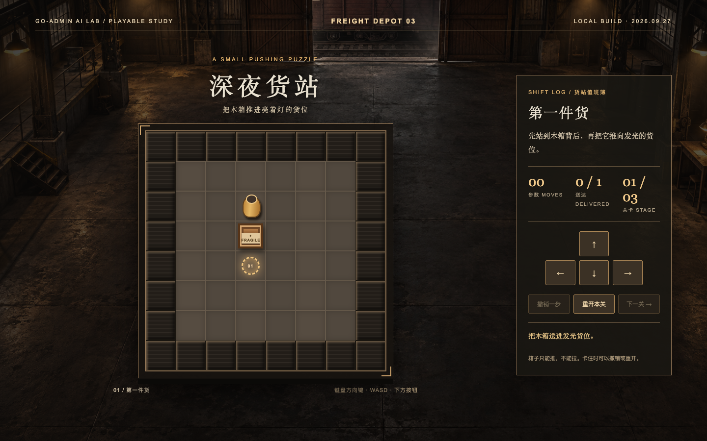

# 深夜货站 · 推箱子

一个可直接在浏览器玩的三关推箱子小游戏。无需安装、账号、后端或 API Key。

## 试玩

部署后可从 GitHub Pages 打开。也可以下载仓库，直接打开 `index.html` 离线游玩。

- 电脑：方向键或 WASD 移动。
- 手机：点击页面内的方向按钮。
- 推错时可以撤销一步或重开本关。箱子只能推，不能拉。
- 三关的实际验证路径：第一关 `D`；第二关 `DDRR`；第三关 `LDDRRURD`（U/D/L/R 分别是上/下/左/右）。

游戏只含静态 HTML、CSS、JavaScript 和一张场景图。GitHub Pages 可从 `main` 分支的仓库根目录直接发布，无需构建步骤。

## 关于作品

这款货站版的关卡、界面和实现独立制作。灵感来自 [@auroral_jp 在 X 上发布的搬箱子小游戏](https://x.com/auroral_jp/status/2103993282414231979)，没有使用对方的角色、关卡布局、图像或代码。

`assets/warehouse.png` 是本项目生成的仓库氛围图；棋盘、箱子、角色、按钮和状态数字由网页代码绘制。仓库中不含密钥或分析脚本，不向第三方发送游戏数据。

## 许可

代码和随仓库提供的图像素材采用 [MIT License](LICENSE)。
